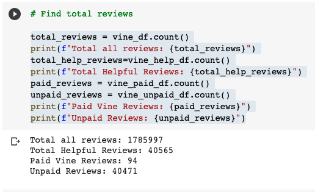
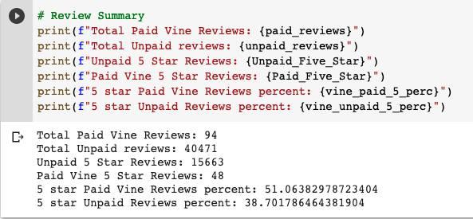
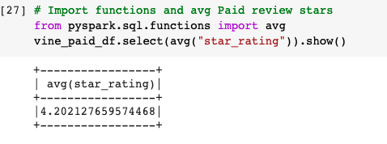
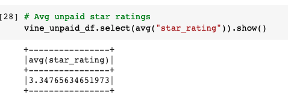

# Amazon_Vine_Analysis

## Overview of Analysis
The purpose of the analysis was to examine any potential bias in the Amazon Vine program with respect to ratings.  Vendors pay Amazon to give their product to a select group, Vine members, who then review the products.  In this analysis, a Video Gsames dataset was used from an S3 AWS bucket.  The data was filtered to examine the reviews that had at least 20 votes and at least 50% of those votes found the review helpful.  Next the data was examined to compare the reviews from the Vine and Non-Vine members and look at differences in the star ratings.  

## Results

- There were a total of 1,785,997 reviews.  When filtered for reviews with at least 20 votes where at least half were considered helpful that number became 40,565.  Of those reviews 94 were from Vine members and 40,471 from non-Vine members.  See figure 1.

- There were 15,711 five star reviews.  48 from Vine members and 15,663 from non-Vine members.  See figure 2.
- 51 percent of the Vine reviews were 5 stars, while 38.7 percent of the non-Vine reviews were 5 stars.  See figure 2.

- Lastly the average star ratings of Paid and Unpaid reviews are in Figures 3 and 4 respectively.

## Summary

There does appear to be a positive shift in the reviews with the Vine members.  As seen above 51% of the Vine members gave 5 star reviews on the games whereas non-Vine members gave only 38.7% five star reviews.  Also when looking at the average star rating for the helpful reviews there is a disparity as well as the average star rating for Vine members was 4.2 star whereas non_Vine star averages were lower at 3.35 stars.  Both of these numbers indicate a shift upwards.  Due to the small number of Vine reviews in the population, they don't have a significant effect where the total reviews are high.  However for new or lightly reviewed products there could be more influence.

Additional work should be done to see if these values are statistically significant.  Sampling to the datasets and understanding their distribution could determine if there is statistical bias.